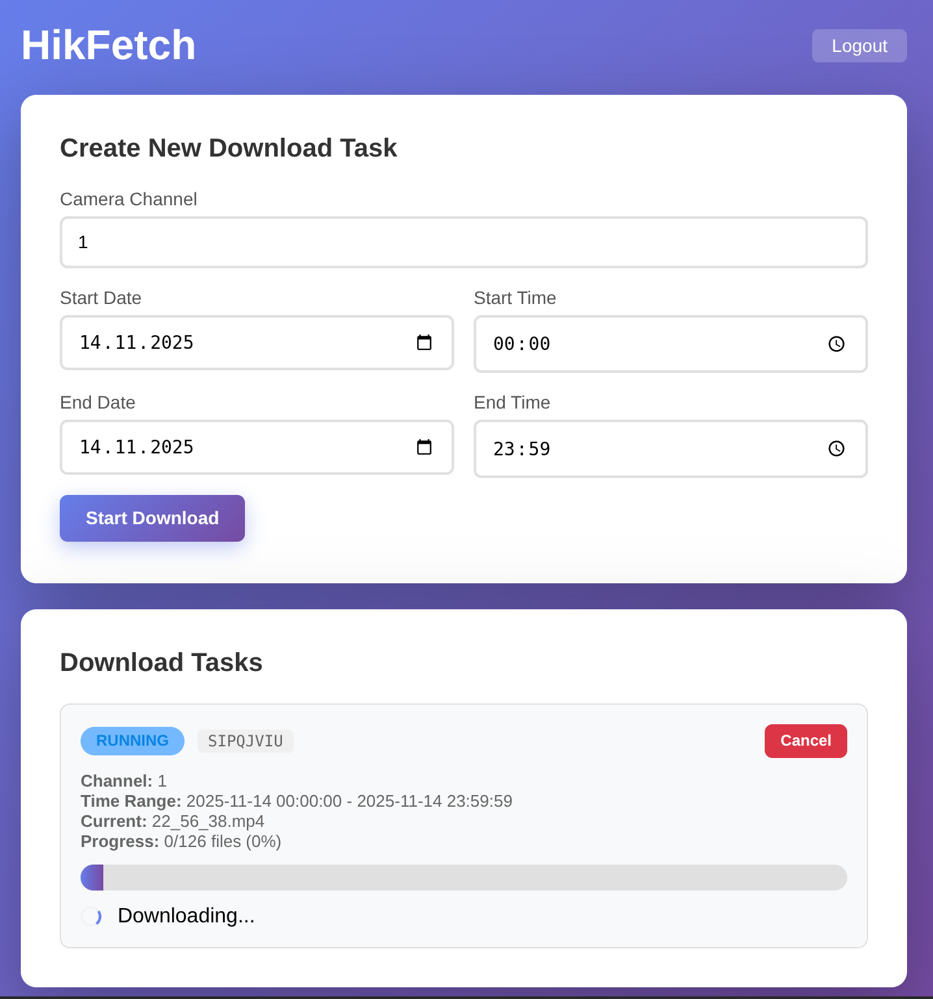

# HikFetch

Web-based GUI for downloading videos from Hikvision/HiWatch cameras and NVRs.



## Features

- Simple WebUI
- Background downloads with download queue
- OIDC or Basic Auth authentication

## Installation

```bash
pip install -r requirements.txt

export HIKFETCH_CAMERA_URL=https://camera.example.com
export HIKFETCH_CAMERA_USERNAME=admin
export HIKFETCH_CAMERA_PASSWORD=your_password
export HIKFETCH_DOWNLOAD_DIR=/path/to/downloads

gunicorn --bind 0.0.0.0:8000 app:app
```

### Configuration Options

#### Required

- `HIKFETCH_CAMERA_URL`: Camera URL with protocol (e.g., `https://camera.example.com`)
- `HIKFETCH_CAMERA_USERNAME`: Camera username
- `HIKFETCH_CAMERA_PASSWORD`: Camera password
- `HIKFETCH_DOWNLOAD_DIR`: Directory for downloaded media

#### Optional

- `HIKFETCH_PUBLIC_URL`: Public URL of the application (e.g., `https://hikfetch.example.com`)
- `HIKFETCH_AUTH_METHOD`: Authentication method (`none`, `basic`, `oidc`; default: `none`)
- `HIKFETCH_WEB_USERNAME`: Basic auth username (leave empty to disable)
- `HIKFETCH_WEB_PASSWORD`: Basic auth password (leave empty to disable)
- `HIKFETCH_SECRET_KEY`: Secret key for Flask sessions (auto-generated if not set)
- `HIKFETCH_SESSION_COOKIE_SECURE`: Set to `true` for HTTPS (default: `false`)
- `HIKFETCH_OIDC_DISCOVERY_URL`: OIDC discovery URL for authentication
- `HIKFETCH_OIDC_CLIENT_ID`: OIDC client ID
- `HIKFETCH_OIDC_CLIENT_SECRET`: OIDC client secret
- `HIKFETCH_OIDC_SCOPES`: OAuth scopes to request (default: `openid profile email groups`)
- `HIKFETCH_OIDC_CLAIM_FIELD`: Claim field for authorization (e.g., `groups`)
- `HIKFETCH_OIDC_ALLOWED_VALUES`: Comma-separated allowed values for the claim field

### OIDC Authentication

**Authelia Example**

```yaml
identity_providers:
  oidc:
    clients:
      - client_id: hikfetch
        client_name: HikFetch
        secret: '...'
        public: false
        authorization_policy: two_factor
        redirect_uris:
          - https://hikfetch.example.com/auth/callback
        scopes:
          - openid
          - profile
          - email
          - groups
        grant_types:
          - authorization_code
        response_types:
          - code
        token_endpoint_auth_method: client_secret_basic
```

## Credits

SDK and protocol implementation based on [hikvision-downloader](https://github.com/qb60/hikvision-downloader).
